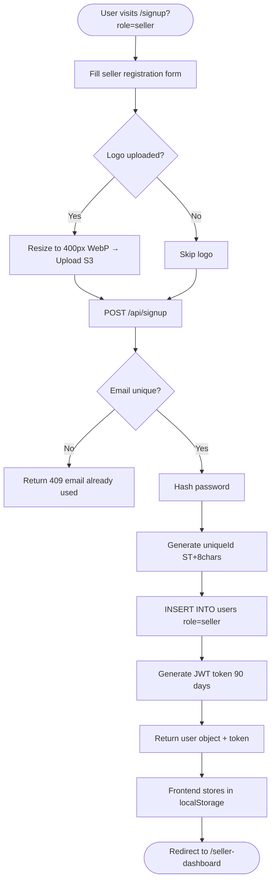
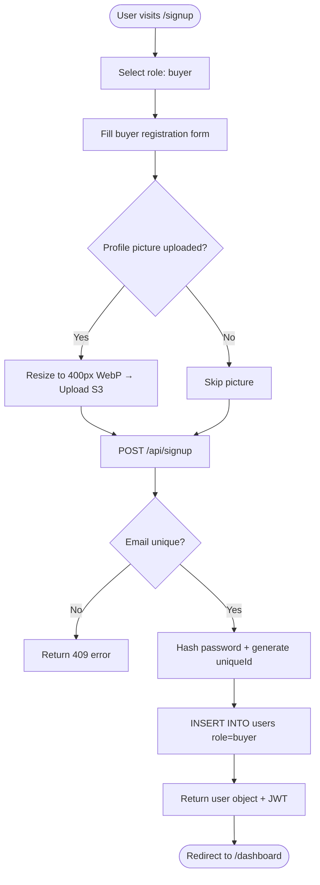
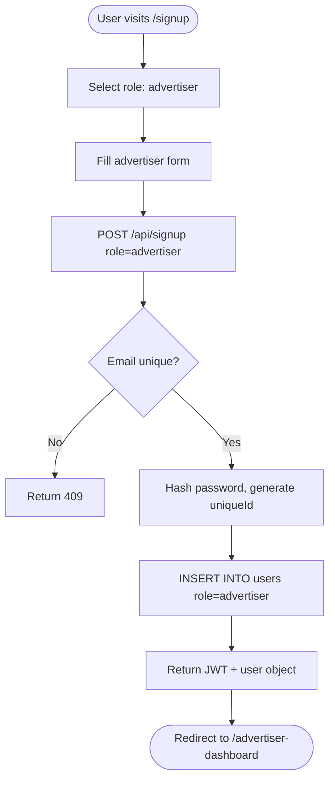
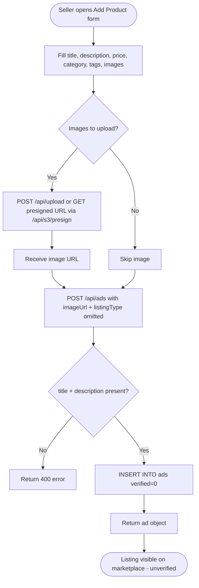
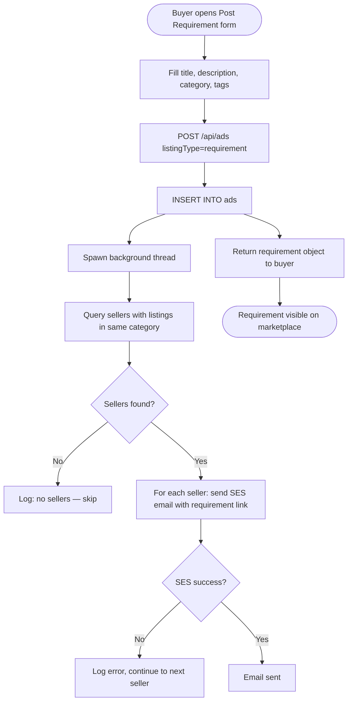
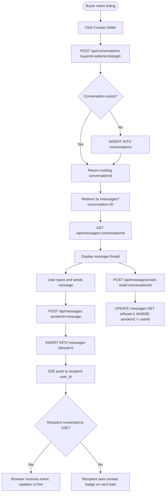
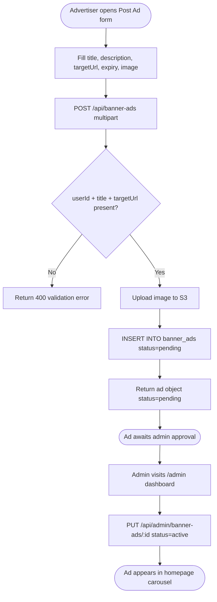

# APP_DOCUMENTATION.md — BigSpice

---

## Overview

BigSpice is a **B2B marketplace** where businesses across all industries can list products and services, post buying requirements, advertise, and communicate directly. It is **not** limited to spices — any B2B product or service category is supported.

- **Live URL:** https://www.bigspice.in
- **Company:** Spice Cloud Technologies Inc., Canada

---

## Architecture

```
┌────────────────────────────────────────┐
│           Nginx (reverse proxy)        │
│  /api/* → Flask  |  /* → Next.js       │
└───────────┬────────────────┬───────────┘
            │                │
     ┌──────▼──────┐  ┌──────▼────────────┐
     │  Flask API  │  │  Next.js Frontend  │
     │  (app.py)   │  │  (nextjs-frontend/)│
     └──────┬──────┘  └───────────────────┘
            │
   ┌────────▼─────────────────────┐
   │  PostgreSQL (psycopg2)       │
   │  AWS S3 (image storage)      │
   │  AWS SES (transactional email│
   └─────────────────────────────┘
```

| Layer            | Technology                           | Notes                                                           |
| ---------------- | ------------------------------------ | --------------------------------------------------------------- |
| Frontend         | Next.js 13 (App Router), TailwindCSS | `nextjs-frontend/app/`                                          |
| Backend API      | Flask (Python), gevent               | `app.py`                                                        |
| Database         | PostgreSQL                           | Direct psycopg2, no ORM                                         |
| Auth             | JWT (PyJWT), HS256, 90-day expiry    | Stored in browser localStorage                                  |
| Image storage    | AWS S3 + Pillow (WebP optimisation)  | Max 1200px products, 400px avatars                              |
| Email            | AWS SES                              | `noreply@bigspice.in`                                           |
| Process manager  | Gunicorn + gevent workers            | `gunicorn.conf.py`                                              |
| Device detection | Custom middleware                    | Mobile → Jinja2 template; Desktop → static HTML (homepage only) |

---

## User Roles

| Role         | Description                                                                | Dashboard route         |
| ------------ | -------------------------------------------------------------------------- | ----------------------- |
| `buyer`      | Posts requirements, contacts sellers, browses listings, maintains wishlist | `/dashboard`            |
| `seller`     | Creates store profile, posts product/service listings, responds to buyers  | `/seller-dashboard`     |
| `advertiser` | Submits banner ads for homepage carousel                                   | `/advertiser-dashboard` |
| `admin`      | Full platform management: users, listings, banner ads                      | `/admin`                |

A user can only hold **one role**. Role is set at signup and stored in `users.role`.

---

## Core Features

1. Seller account creation
2. Buyer account creation
3. Advertiser account creation
4. Post a product listing
5. Post a service listing
6. Post a buying requirement
7. Chat between buyer and seller
8. Ad posting (banner ads)
9. Account management (profile, password reset)

---

## Feature Documentation

---

### 1. Seller Account Creation

**Purpose:** Register a business as a Seller so they can list products/services and receive buyer leads.

**Flow:**

1. User visits `/signup` (or clicks "Become a Seller" → `/signup?role=seller`).
2. Frontend pre-selects role = `seller`.
3. User fills: name, email, password, phone, store name, business type, product/service categories, address, shipping locations, website (optional), tax number (optional), store logo (optional).
4. User checks the Terms of Service + Privacy Policy agreement checkbox.
5. Frontend submits `multipart/form-data` to `POST /api/signup`.
6. Backend:
   - Validates email + password are present.
   - If logo file uploaded: resize to max 400px, convert to WebP, upload to S3 → store S3 URL.
   - Hash password with werkzeug (bcrypt).
   - Generate unique ID (`ST` + 8 random chars).
   - `INSERT INTO users` with role = `seller`.
7. Backend returns JWT token + full user object.
8. Frontend stores user in `localStorage`, redirects to `/seller-dashboard`.

**Inputs:** `name`, `email`, `password`, `phone`, `role=seller`, `storeName`, `businessType`, `categories`, `taxNumber`, `address`, `website`, `shippingLocations[]`, `logo` (file)

**Outputs:** `{ success, userId, id, name, email, role, storeName, token, uniqueId, … }`

**Edge cases:**

- Duplicate email → `409 { error: "email already used" }`
- No logo → `logo_path` is `null`
- `website` is normalised: bare domains get `https://` prepended



---

### 2. Buyer Account Creation

**Purpose:** Register as a Buyer to post requirements and contact sellers.

**Flow:**

1. User visits `/signup`, selects role = `buyer`.
2. User fills: name, email, password, phone, location, profile picture (optional).
3. Checks Terms + Privacy checkbox.
4. Frontend submits `multipart/form-data` to `POST /api/signup`.
5. Backend: same path as seller — profile picture uploaded to S3 if provided, hashed password, unique ID generated, `INSERT INTO users` with role = `buyer`.
6. Returns JWT + user object.
7. Frontend stores in `localStorage`, redirects to `/dashboard`.

**Inputs:** `name`, `email`, `password`, `phone`, `role=buyer`, `location`, `profilePicture` (file)

**Outputs:** `{ success, userId, id, name, email, role, token, uniqueId, profilePicture, … }`

**Edge cases:**

- Buyer does not need storeName, businessType, categories — these fields are optional and stored as `null`.
- Same 409 on duplicate email.



---

### 3. Advertiser Account Creation

**Purpose:** Register as an Advertiser to place banner ads on the homepage carousel.

**Flow:**

1. User visits `/signup`, selects role = `advertiser`.
2. User fills: name, email, password, phone, company name (maps to `storeName`), address, website.
3. Frontend submits to `POST /api/signup` with `role=advertiser`.
4. Backend inserts user; `storeName` is populated from `advertiserCompany` form field if `storeName` is absent.
5. Returns JWT + user object.
6. Frontend redirects to `/advertiser-dashboard`.

**Inputs:** `name`, `email`, `password`, `phone`, `role=advertiser`, `advertiserCompany` (→ `storeName`), `address`, `website`

**Outputs:** `{ success, userId, token, role: "advertiser", … }`



---

### 4. Post a Product Listing

**Purpose:** Sellers publish a physical product for sale on the marketplace.

**Flow:**

1. Seller goes to `/seller-dashboard` → "Add Listing" or "Add Product".
2. Frontend submits `POST /api/ads` (JSON) with `listingType = null` (or omitted) and a `price` value set.
3. Backend inserts into `ads` table. `verified` defaults to `0`.
4. Listing appears in `GET /api/ads` results filtered by role/category.
5. Admin can verify via `PUT /api/admin/ads/:id` setting `verified = 1`.

**Inputs (JSON):** `title`, `description`, `userId`, `category`, `tags[]`, `price`, `unit`, `minOrder`, `stock`, `imageUrl`, `images` (JSON array of URLs), `listingType` (omit or `null`)

**Outputs:** `{ success, id, title, description, userId, category, tags, price, unit, … }`

**Edge cases:**

- `title` or `description` missing → `400 { error: "title and description required" }`
- Image upload is separate: call `POST /api/upload` (local) or `POST /api/s3/presign` (S3 presigned URL) first, then include returned URL in `imageUrl`.
- `tags` stored as JSON string in DB, parsed back to array on read.



---

### 5. Post a Service Listing

**Purpose:** Sellers publish a service offering. Identical to product posting except `price` may be omitted or set to a rate, and there is typically no `stock`.

**Flow:** Same as product posting. Set `listingType = null`. Omit `stock`. Set `unit` to e.g. "per project" or "per hour".

**Distinction from product:** Only semantic — no separate API field. The frontend renders the listing card differently based on category or description content.

---

### 6. Post a Buying Requirement

**Purpose:** Buyers post what they are looking for. The system automatically notifies matching sellers by email.

**Flow:**

1. Buyer opens `/dashboard` → "Post Requirement".
2. Buyer fills: title (e.g. "Looking for organic turmeric"), description, category, tags.
3. Frontend submits `POST /api/ads` with `listingType = "requirement"` and no `price`.
4. Backend inserts the requirement into `ads` table.
5. Backend spawns a background thread calling `notify_sellers_of_requirement(ad_id, title, description, category, buyer_name, base_url)`.
6. Background thread queries: `SELECT DISTINCT sellers WHERE role='seller' AND has a listing in same category AND listing is not itself a requirement`.
7. For each matching seller: sends SES email with subject "New Buyer Requirement: {title}" and a link to `{APP_URL}/listing/{ad_id}`.
8. Requirement appears in `GET /api/ads` with `listingType = "requirement"`.

**Inputs (JSON):** `title`, `description`, `userId`, `category`, `tags[]`, `listingType = "requirement"`

**Outputs:** `{ success, id, listingType: "requirement", … }`

**Edge cases:**

- If no sellers matched by category: email skipped silently; requirement still posted.
- SES send failures are caught per-seller and logged; other sellers still receive notifications.
- `price` should be `null` for requirements; the UI filters out requirements from product search by checking `listingType`.



---

### 7. Chat System

**Purpose:** Direct one-to-one messaging between a buyer and a seller, optionally linked to a specific listing.

**Flow:**

1. Buyer clicks "Contact Seller" on a listing page.
2. Frontend calls `POST /api/conversations` with `{ buyerId, sellerId, listingId }`.
3. Backend checks if a conversation already exists between this buyer–seller pair. If yes, returns existing `conversationId`. If no, inserts new row.
4. Frontend redirects to `/messages?conversation={id}`.
5. User loads conversation messages via `GET /api/messages/{conversation_id}`.
6. User sends a message via `POST /api/messages` with `{ conversationId, senderId, message }`.
7. Backend inserts message, then **pushes real-time notification** via SSE: calls `_sse_push(recipient_id, { type: "new_message", … })`.
8. Recipient's browser (subscribed to `GET /api/sse/{user_id}`) receives the SSE event and updates the UI instantly.
9. On opening a conversation, frontend calls `POST /api/messages/mark-read/{conversation_id}` with `{ userId }` to clear the unread badge.
10. Unread count is polled via `GET /api/messages/unread/{user_id}`.

**Inputs — start conversation:** `{ buyerId, sellerId, listingId? }`

**Inputs — send message:** `{ conversationId, senderId, message }`

**Outputs — conversation list:** Array of conversations with `lastMessage`, `lastMessageTime`, `unreadCount`, both user names/pictures.

**Edge cases:**

- Duplicate conversation: `POST /api/conversations` is idempotent — returns existing ID.
- SSE connection drops: keepalive comment sent every 25 s; client should reconnect on close.
- `isRead` stored as integer `0`/`1` (not boolean) for SQLite compatibility legacy.



---

### 8. Ad Posting (Banner Ads)

**Purpose:** Advertisers submit a banner image ad for display in the homepage carousel.

**Flow:**

1. Advertiser goes to `/advertiser-dashboard` → "Post Ad".
2. Form fields: title, description, target URL, expiry date, contact name, contact number, industry, address, notes, banner image.
3. Frontend submits `multipart/form-data` to `POST /api/banner-ads`.
4. Backend:
   - Validates `userId`, `title`, `targetUrl` are present.
   - Uploads image to S3, stores URL.
   - Inserts into `banner_ads` with `status = 'pending'` (requires admin approval before going live).
5. Admin reviews via `/admin` → approves by `PUT /api/admin/banner-ads/:id` setting `status = 'active'`.
6. Active non-expired banner ads appear in `GET /api/banner-ads` and display in the homepage carousel.

**Inputs (form-data):** `userId`, `title`, `description`, `targetUrl`, `expiresAt`, `contactName`, `contactNumber`, `industry`, `adAddress`, `notes`, `image` (file)

**Outputs:** `{ success, id, status: "pending", imageUrl, … }`

**Edge cases:**

- `expiresAt = null` → ad never expires (shown indefinitely while `status = 'active'`).
- If no active banner ads exist, the homepage carousel shows 4 hard-coded default banners seeded at startup.
- `targetUrl` is normalised: bare domains get `https://` prepended.



---

### 9. Account Management

**Purpose:** Users update their profile details and recover lost passwords.

#### 9a. Profile Update

1. User visits their dashboard settings.
2. Frontend sends `PUT /api/user/profile` (Bearer JWT required) with any changed fields.
3. Backend dynamically builds `UPDATE users SET ...` for provided fields only.
4. If a new logo/profile picture is uploaded, old image is replaced on S3.

**Auth:** Requires `Authorization: Bearer <jwt>` header.

#### 9b. Password Reset (Forgot Password)

1. User clicks "Forgot password?" on `/login`.
2. User enters email on `/forgot-password`.
3. Frontend posts `POST /api/forgot-password` with `{ email }`.
4. Backend:
   - Looks up user by email (case-insensitive).
   - If not found: returns success anyway (prevents email enumeration).
   - Invalidates any existing unused tokens for that user.
   - Generates a `secrets.token_urlsafe(32)` token, stores in `password_reset_tokens` with 1-hour expiry.
   - Sends SES email with link: `{APP_URL}/reset-password?token=<token>`.
5. User clicks link → arrives at `/reset-password?token=<token>`.
6. User enters new password (min 8 chars) + confirmation.
7. Frontend posts `POST /api/reset-password` with `{ token, password }`.
8. Backend:
   - Validates token: must exist, `used = false`, `expires_at > now()`.
   - Hashes new password, updates `users.password`.
   - Marks token `used = true`.
9. Frontend redirects to `/login`.

**Edge cases:**

- Invalid/expired token → `400 { error: "…" }`, frontend shows "Request a new link" UI.
- Token is single-use; any reuse returns an error.
- Requesting a new reset invalidates all prior unused tokens for that user.

```mermaid
flowchart TD
    A([User on /login clicks Forgot password]) --> B[/forgot-password page]
    B --> C[Enter email → POST /api/forgot-password]
    C --> D{Email found in users?}
    D -- No --> E[Return success anyway - no enumeration]
    D -- Yes --> F[Invalidate prior unused tokens]
    F --> G[Generate token, set expires_at = now+1h]
    G --> H[INSERT INTO password_reset_tokens]
    H --> I[Send SES email with reset link]
    I --> J([User clicks email link → /reset-password?token=X])
    J --> K[User enters new password + confirm]
    K --> L[POST /api/reset-password token+password]
    L --> M{Token valid, unused, not expired?}
    M -- No --> N[Return 400 - show Request new link UI]
    M -- Yes --> O[Hash new password, UPDATE users]
    O --> P[Mark token used=true]
    P --> Q([Redirect to /login])
```

---

## Data Models

### `users`

| Column                                                                                                                                                          | Type        | Notes                                      |
| --------------------------------------------------------------------------------------------------------------------------------------------------------------- | ----------- | ------------------------------------------ |
| `id`                                                                                                                                                            | SERIAL PK   |                                            |
| `name`                                                                                                                                                          | TEXT        |                                            |
| `email`                                                                                                                                                         | TEXT UNIQUE | Used for login                             |
| `password`                                                                                                                                                      | TEXT        | bcrypt hash                                |
| `phone`                                                                                                                                                         | TEXT        |                                            |
| `role`                                                                                                                                                          | TEXT        | `buyer` / `seller` / `advertiser`          |
| `storeName`                                                                                                                                                     | TEXT        | Seller store name or advertiser company    |
| `businessType`                                                                                                                                                  | TEXT        |                                            |
| `categories`                                                                                                                                                    | TEXT        | Comma-separated product/service categories |
| `taxNumber`                                                                                                                                                     | TEXT        | Optional                                   |
| `address`                                                                                                                                                       | TEXT        |                                            |
| `website`                                                                                                                                                       | TEXT        | Normalised with `https://`                 |
| `shippingLocations`                                                                                                                                             | TEXT        | Comma-separated                            |
| `logo_path`                                                                                                                                                     | TEXT        | S3 URL                                     |
| `profilePicture`                                                                                                                                                | TEXT        | S3 URL (buyers)                            |
| `uniqueId`                                                                                                                                                      | TEXT        | `ST` + 8 random uppercase chars            |
| `location`                                                                                                                                                      | TEXT        |                                            |
| `store_views`                                                                                                                                                   | INTEGER     | View counter                               |
| `tagline`, `storeDescription`, `ownerMessage`, `yearEstablished`, `employeeCount`, `annualTurnover`, `paymentModes`, `exportMarkets`, `certifications`, `whyUs` | TEXT        | Optional extended seller profile fields    |
| `createdAt`                                                                                                                                                     | TIMESTAMP   | Auto                                       |

---

### `ads`

| Column        | Type               | Notes                                                         |
| ------------- | ------------------ | ------------------------------------------------------------- |
| `id`          | SERIAL PK          |                                                               |
| `title`       | TEXT               | Required                                                      |
| `description` | TEXT               | Required                                                      |
| `userId`      | INTEGER FK → users | Owner                                                         |
| `category`    | TEXT               | Used for seller notification matching                         |
| `tags`        | TEXT               | JSON array stored as string                                   |
| `price`       | REAL               | `null` for requirements/services                              |
| `unit`        | TEXT               | e.g. "kg", "per project"                                      |
| `minOrder`    | INTEGER            | Default 1                                                     |
| `stock`       | INTEGER            |                                                               |
| `imageUrl`    | TEXT               | Primary image S3 URL                                          |
| `images`      | TEXT               | JSON array of additional image URLs                           |
| `verified`    | INTEGER            | `0` = unverified, `1` = admin verified                        |
| `views`       | INTEGER            |                                                               |
| `listingType` | TEXT               | `null` = product/service, `"requirement"` = buyer requirement |
| `createdAt`   | TIMESTAMP          | Auto                                                          |

**Relationships:** `ads.userId → users.id`

---

### `conversations` + `messages` (Chat)

**conversations**

| Column      | Type               | Notes                                        |
| ----------- | ------------------ | -------------------------------------------- |
| `id`        | SERIAL PK          |                                              |
| `buyerId`   | INTEGER FK → users |                                              |
| `sellerId`  | INTEGER FK → users |                                              |
| `listingId` | INTEGER FK → ads   | Optional, the listing that prompted the chat |
| `createdAt` | TIMESTAMP          |                                              |

**Unique constraint:** One conversation per buyer–seller pair (enforced by application logic check before insert).

**messages**

| Column           | Type                       | Notes                    |
| ---------------- | -------------------------- | ------------------------ |
| `id`             | SERIAL PK                  |                          |
| `conversationId` | INTEGER FK → conversations |                          |
| `senderId`       | INTEGER FK → users         |                          |
| `message`        | TEXT                       |                          |
| `isRead`         | INTEGER                    | `0` = unread, `1` = read |
| `createdAt`      | TIMESTAMP                  |                          |

---

### `banner_ads`

| Column                                                           | Type               | Notes                              |
| ---------------------------------------------------------------- | ------------------ | ---------------------------------- |
| `id`                                                             | SERIAL PK          |                                    |
| `userId`                                                         | INTEGER FK → users | Advertiser                         |
| `title`                                                          | TEXT               | Required                           |
| `description`                                                    | TEXT               |                                    |
| `imageUrl`                                                       | TEXT               | S3 URL, required                   |
| `targetUrl`                                                      | TEXT               | Click-through URL, required        |
| `status`                                                         | TEXT               | `pending` → `active` \| `rejected` |
| `expiresAt`                                                      | TIMESTAMP          | `null` = no expiry                 |
| `contactName`, `contactNumber`, `industry`, `adAddress`, `notes` | TEXT               | Advertiser contact metadata        |
| `createdAt`                                                      | TIMESTAMP          |                                    |

---

### `password_reset_tokens`

| Column       | Type                       | Notes                                 |
| ------------ | -------------------------- | ------------------------------------- |
| `id`         | SERIAL PK                  |                                       |
| `user_id`    | INTEGER FK → users CASCADE |                                       |
| `token`      | TEXT UNIQUE                | `secrets.token_urlsafe(32)`           |
| `expires_at` | TIMESTAMP                  | `now() + 1 hour`                      |
| `used`       | BOOLEAN                    | Default `false`; set `true` after use |
| `created_at` | TIMESTAMP                  |                                       |

---

### `wishlist`

| Column      | Type               | Notes                    |
| ----------- | ------------------ | ------------------------ |
| `id`        | SERIAL PK          |                          |
| `userId`    | INTEGER FK → users |                          |
| `adId`      | INTEGER FK → ads   |                          |
| `createdAt` | TIMESTAMP          |                          |
| UNIQUE      | `(userId, adId)`   | Prevents duplicate saves |

---

### `reviews`

| Column       | Type               | Notes                           |
| ------------ | ------------------ | ------------------------------- |
| `id`         | SERIAL PK          |                                 |
| `adId`       | INTEGER FK → ads   |                                 |
| `userId`     | INTEGER FK → users | Reviewer                        |
| `rating`     | INTEGER            | 1–5 (CHECK constraint)          |
| `reviewText` | TEXT               |                                 |
| `createdAt`  | TIMESTAMP          |                                 |
| UNIQUE       | `(userId, adId)`   | One review per user per listing |

---

## Key Business Rules

1. **Email enumeration prevention:** `POST /api/forgot-password` always returns `{ success: true }` regardless of whether the email exists.

2. **Password reset token lifecycle:** Token is valid for 1 hour, single-use. Requesting a new reset invalidates all prior unused tokens for that user.

3. **Requirement → seller notification:** When `listingType = "requirement"` is posted, only sellers who already have at least one non-requirement listing in the **same category** receive an email. Sellers without listings in that category are not notified.

4. **Listing verification:** All listings default to `verified = 0`. Admin must explicitly set `verified = 1`. The frontend may display a verified badge for verified listings.

5. **Banner ad approval:** Banner ads start as `status = "pending"`. Only `status = "active"` ads with `expiresAt IS NULL OR expiresAt >= CURRENT_DATE` are returned by `GET /api/banner-ads`.

6. **Image optimisation:** All uploaded images are converted to WebP. Products are resized to max 1200px (longest edge); logos/avatars to max 400px. Falls back to raw save if Pillow is unavailable.

7. **Conversation deduplication:** Only one conversation can exist per buyer–seller pair. `POST /api/conversations` is idempotent.

8. **JWT expiry:** Tokens expire after 90 days. Expired tokens return `401 { error: "token expired" }`. Clients must prompt re-login.

9. **Role immutability:** Role is set at signup. There is no API endpoint to change a user's role post-registration.

10. **Website URL normalisation:** Any `website` or `targetUrl` field without a scheme gets `https://` prepended before storage.

---

## API Reference (Summary)

| Method | Path                                      | Auth       | Description                   |
| ------ | ----------------------------------------- | ---------- | ----------------------------- |
| POST   | `/api/signup`                             | None       | Register any role             |
| POST   | `/api/login`                              | None       | Login, returns JWT            |
| POST   | `/api/forgot-password`                    | None       | Send password reset email     |
| POST   | `/api/reset-password`                     | None       | Set new password via token    |
| GET    | `/api/ads`                                | None       | List all ads/requirements     |
| POST   | `/api/ads`                                | None\*     | Create listing or requirement |
| PUT    | `/api/ads/:id`                            | None\*     | Update listing                |
| DELETE | `/api/ads/:id`                            | None\*     | Delete listing                |
| POST   | `/api/ads/:id/view`                       | None       | Increment view count          |
| GET    | `/api/stores`                             | None       | List seller stores            |
| POST   | `/api/stores/:id/view`                    | None       | Increment store view count    |
| GET    | `/api/user/public/:id`                    | None       | Public user/store profile     |
| PUT    | `/api/user/profile`                       | Bearer JWT | Update own profile            |
| POST   | `/api/conversations`                      | None\*     | Start/get conversation        |
| GET    | `/api/conversations/:userId`              | None\*     | List conversations for user   |
| GET    | `/api/messages/:conversationId`           | None\*     | Fetch messages                |
| POST   | `/api/messages`                           | None\*     | Send message                  |
| GET    | `/api/sse/:userId`                        | None       | SSE real-time stream          |
| POST   | `/api/messages/mark-read/:conversationId` | None\*     | Mark messages read            |
| GET    | `/api/messages/unread/:userId`            | None\*     | Get unread count              |
| GET    | `/api/banner-ads`                         | None       | Active homepage banners       |
| POST   | `/api/banner-ads`                         | None\*     | Submit banner ad              |
| GET    | `/api/banner-ads/my/:userId`              | None\*     | Advertiser's own ads          |
| PUT    | `/api/banner-ads/:id`                     | None\*     | Update banner ad              |
| DELETE | `/api/banner-ads/:id`                     | None\*     | Delete banner ad              |
| GET    | `/api/wishlist/:userId`                   | None\*     | Get wishlist                  |
| POST   | `/api/wishlist`                           | None\*     | Add to wishlist               |
| DELETE | `/api/wishlist/:id`                       | None\*     | Remove from wishlist          |
| POST   | `/api/wishlist/check`                     | None\*     | Check if item wishlisted      |
| GET    | `/api/reviews/:adId`                      | None       | Get reviews for listing       |
| POST   | `/api/reviews`                            | None\*     | Submit review                 |
| DELETE | `/api/reviews/:reviewId`                  | None\*     | Delete review                 |
| GET    | `/api/reviews/stats/:adId`                | None       | Rating stats for listing      |
| POST   | `/api/reviews/can-review/:adId`           | None\*     | Check if user can review      |
| POST   | `/api/upload`                             | None       | Upload image (local fallback) |
| POST   | `/api/s3/presign`                         | None       | Get S3 presigned upload URL   |
| GET    | `/api/health`                             | None       | Health check                  |
| GET    | `/api/admin/users`                        | None\*     | List all users (admin)        |
| PUT    | `/api/admin/users/:id`                    | None\*     | Edit user (admin)             |
| PUT    | `/api/admin/users/:id/password`           | None\*     | Reset user password (admin)   |
| DELETE | `/api/admin/users/:id`                    | None\*     | Delete user (admin)           |
| GET    | `/api/admin/ads`                          | None\*     | List all ads (admin)          |
| PUT    | `/api/admin/ads/:id`                      | None\*     | Edit/verify ad (admin)        |
| DELETE | `/api/admin/ads/:id`                      | None\*     | Delete ad (admin)             |
| GET    | `/api/admin/banner-ads`                   | None\*     | List all banner ads (admin)   |
| PUT    | `/api/admin/banner-ads/:id`               | None\*     | Approve/reject banner (admin) |
| DELETE | `/api/admin/banner-ads/:id`               | None\*     | Delete banner ad (admin)      |

\* Routes marked `None*` perform their own `userId` ownership checks in application logic rather than using the Bearer JWT middleware. The JWT Bearer middleware is only applied to `PUT /api/user/profile` via the `@require_auth` decorator.

---

## Frontend Pages (Next.js App Router)

| Route                   | File                                | Role                          |
| ----------------------- | ----------------------------------- | ----------------------------- |
| `/`                     | `public/index.html` (Flask static)  | Homepage with banner carousel |
| `/login`                | `app/login/page.tsx`                | Login form                    |
| `/signup`               | `app/signup/page.tsx`               | Registration (all roles)      |
| `/forgot-password`      | `app/forgot-password/page.tsx`      | Request reset email           |
| `/reset-password`       | `app/reset-password/page.tsx`       | Set new password via token    |
| `/dashboard`            | `app/dashboard/page.tsx`            | Buyer dashboard               |
| `/seller-dashboard`     | `app/seller-dashboard/page.tsx`     | Seller dashboard              |
| `/advertiser-dashboard` | `app/advertiser-dashboard/page.tsx` | Advertiser dashboard          |
| `/admin`                | `app/admin/page.tsx`                | Admin panel                   |
| `/listings`             | `app/listings/page.tsx`             | All listings browse           |
| `/listing/:id`          | `app/listing/page.tsx`              | Individual listing detail     |
| `/stores`               | `app/stores/page.tsx`               | All stores                    |
| `/store/:id`            | `app/store/page.tsx`                | Store profile                 |
| `/messages`             | `app/messages/page.tsx`             | Chat inbox                    |
| `/profile`              | `app/profile/page.tsx`              | Own profile management        |
| `/wishlist`             | `app/wishlist/page.tsx`             | Saved listings                |
| `/faq`                  | `app/faq/page.tsx`                  | FAQ                           |
| `/terms`                | `app/terms/page.tsx`                | Terms of Service              |
| `/privacy`              | `app/privacy/page.tsx`              | Privacy Policy                |

---

_End of APP_DOCUMENTATION.md_
